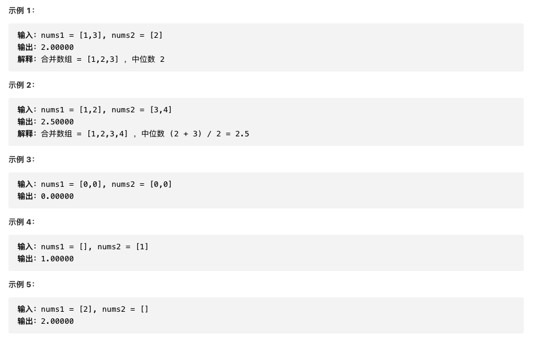

给定两个大小分别为 m 和 n 的正序（从小到大）数组 nums1 和 nums2。请你找出并返回这两个正序数组的 中位数 。



```js
/**
 * @param {number[]} nums1
 * @param {number[]} nums2
 * @return {number}
 */
var findMedianSortedArrays = function (nums1, nums2) {
  let numList = nums1.concat(nums2).sort((a, b) => a - b)
  const l = numList.length
  return l % 2
    ? numList[Math.floor(l / 2)]
    : (numList[l / 2 - 1] + numList[l / 2]) / 2
}
```
