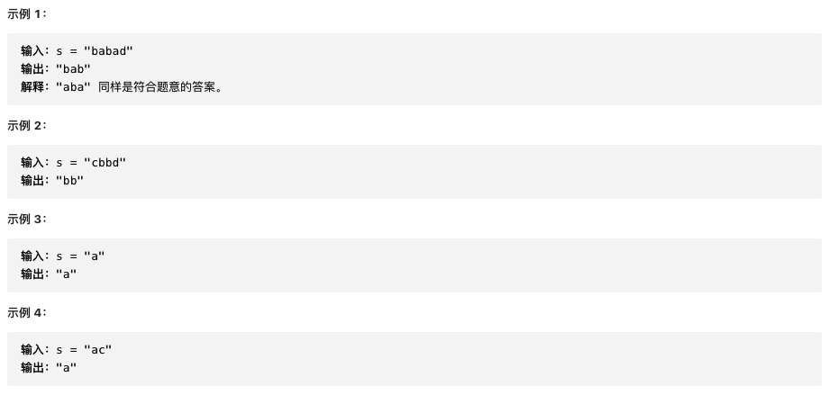

给你一个字符串 `s`，找到 `s` 中最长的回文子串。


```js
/**
 * @param {string} s
 * @return {string}
 */
var longestPalindrome = function (s) {
  if (s.length < 2) {
    return s
  }
  let res = ''
  for (let i = 0; i < s.length; i++) {
    // 回文子串长度是奇数
    helper(i, i)
    // 回文子串长度是偶数
    helper(i, i + 1)
  }

  function helper(m, n) {
    while (m >= 0 && n < s.length && s[m] == s[n]) {
      m--
      n++
    }
    // 注意此处m,n的值循环完后  是恰好不满足循环条件的时刻
    // 此时m到n的距离为n-m+1，但是mn两个边界不能取 所以应该取m+1到n-1的区间  长度是n-m-1
    if (n - m - 1 > res.length) {
      // slice也要取[m+1,n-1]这个区间
      res = s.slice(m + 1, n)
    }
  }
  return res
}
```

```js
/**
 * @param {string} s
 * @return {string}
 */
var longestPalindrome = function (s) {
  if (s.length <= 1) return s

  // construct a 2D array
  const dp = [...new Array(s.length + 1)].map((_) =>
    new Array(s.length + 1).fill(false)
  )

  let lps = ''

  // base case for one character
  for (let i = 0; i < s.length; i++) {
    dp[i][i] = true
    lps = s[i]
  }

  // base case for two characters
  for (let i = 0; i < s.length; i++) {
    if (s[i] === s[i + 1]) dp[i][i + 1] = true
    if (dp[i][i + 1]) lps = s.substring(i, i + 2)
  }

  // expand to three or more characters
  for (let i = s.length - 1; i >= 0; i--) {
    for (let j = i + 2; j < s.length; j++) {
      dp[i][j] = dp[i + 1][j - 1] && s[i] === s[j]
      if (dp[i][j]) lps = lps.length < j - i + 1 ? s.substring(i, j + 1) : lps
    }
  }

  return lps
}
```

```js
/**
 * @param {string} s
 * @return {string}
 */
var longestPalindrome = function (s) {
  // Manacher's Algorithm

  // Justify if {string} s is totally palindrome string
  var i,
    len = Math.floor(s.length / 2) + 1,
    isTotalPalindrome = true

  for (i = 0; i < len; i++) {
    if (s[i] != s[s.length - i - 1]) {
      isTotalPalindrome = false
      break
    }
  }

  if (isTotalPalindrome) return s

  // preprocess, make {string} s must contain a palindrome of odd length
  s = [].join.call(s, '#')
  s = '$#' + s + '#$'

  var p = [],
    C = 1,
    R = 1,
    iMirror,
    max = 0,
    maxIndex

  for (i = 1; i < s.length - 1; i++) {
    iMirror = 2 * C - i
    p[i] = R > i ? Math.min(R - i, p[iMirror]) : 1

    while (s[i - p[i]] == s[i + p[i]]) p[i]++

    if (i + p[i] > R) {
      R = i + p[i]
      C = i
    }

    if (p[i] > max) {
      max = p[i]
      maxIndex = i
    }
  }

  return s.substr(maxIndex - max + 1, 2 * max - 1).replace(/[$#]/g, '')
}
```
